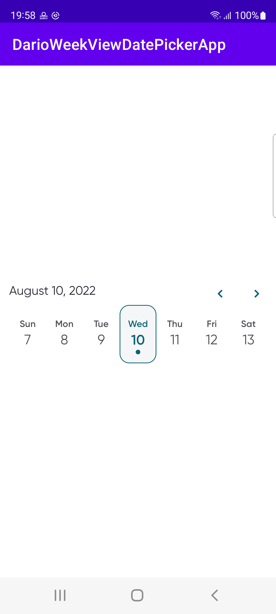

# DarioWeekViewDatePicker
An Android week view component for selecting a date



## Install
root `build.gradle` file:
```gradle
allprojects {
    repositories {
        ...
        maven { url 'https://jitpack.io' }
    }
}
```

app `build.gradle` file:
```gradle
implementation 'com.github.myDario:DarioWeekViewDatePicker:1.0.2'
```

## Usage
```xml
<com.labstyle.darioweekviewdatepicker.DarioWeekViewDatePicker
    android:id="@+id/datePicker"
    android:layout_width="match_parent"
    android:layout_height="wrap_content" />
```

## Selection change listener
```kotlin
findViewById<DarioWeekViewDatePicker>(R.id.datePicker).onSelectionChanged = { date ->
    // ...
}
```

## Select a date at runtime
```kotlin
findViewById<DarioWeekViewDatePicker>(R.id.datePicker).setSelection(date)
```

## V 1.0.2 Release notes
* Removing scrollview and centering days
* Adding today button
* Adding Today string to date (in case today selected)
* Rename left/right arrows to resolve conflict in code